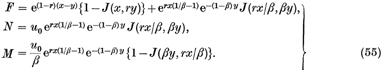
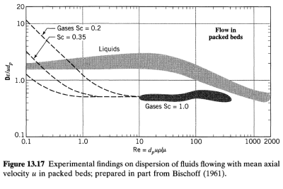

```{r echo=F, cache=F}
library(knitr)
opts_chunk$set(dev='svg',cache=T, tidy=F, echo=F)

toDataFrameDropping <- function(x, prefix='', nn=1) {
    d0 <- list()
    for (n in names(x)) {
        xn <- x[[n]]
        if ((is.integer(xn) | is.double(xn) | is.character(xn)) & length(xn) == nn) {
            d0[[ paste(prefix, n, sep='') ]] <- xn
        }
    }
    data.frame(d0)
}


```

# Summary

Two models are set-up and analyzed for the adsorption column. Only the loading
step is considered. The first model could apply to any situation, but neglects
dispersion. The second applies only to the situation where concentration
profiles have a tendency to sharpen, but has the benefit of also considering
dispersion.

An optimization is done with the second yielding decisions for the column
length and cross-sectional area, cycle time and resin particle size.

Several sensitivity analyses are done. Results tentatively suggest that a
cooler upstream of the column may be unnecessary, or at least that it is unnecessary for it to be large enough to cool the feed all the way down to 20 °C. A
second analysis suggests that the particle diameter is not very important so
long as it is within rather wide bounds.


+----------------------------------+-------------+-------------------------------------------------------------------------------+
| Variable                         | unit        | Description                                                                   |
+==================================+=============+===============================================================================+
| $a = 6(1-\alpha)/D_p$            | 1/m         | particle surface area per unit volume                                         |
+----------------------------------+-------------+-------------------------------------------------------------------------------+
| $c$                              | kg / m3     | ferulic acid concentration in the liquid phase                                |
+----------------------------------+-------------+-------------------------------------------------------------------------------+
| $c_0$                            | kg / m3     | ferulic acid concentration in the feed liquid                                 |
+----------------------------------+-------------+-------------------------------------------------------------------------------+
| $f(c) = K'Qc/(1 + K'c)$          | kg/m3       | ferulic acid concentration in the solid at equilibrium with a liquid at $c$   |
+----------------------------------+-------------+-------------------------------------------------------------------------------+
| $k_La$                           | 1/s         | mass transfer coefficient (including surface area per volume term)            |
+----------------------------------+-------------+-------------------------------------------------------------------------------+
| $k' = K'k_La$                    | m3 / kg / s | mass transfer coefficient                                                     |
+----------------------------------+-------------+-------------------------------------------------------------------------------+
| $q$                              | kg / m3     | ferulic acid concentration in the solid                                       |
+----------------------------------+-------------+-------------------------------------------------------------------------------+
| $r$                              | 1           | deviation from isotherm (see eq 9 below)                                      |
+----------------------------------+-------------+-------------------------------------------------------------------------------+
| $t$                              | s           | time                                                                          |
+----------------------------------+-------------+-------------------------------------------------------------------------------+
| $u_s = R / \alpha$               | m/s         | superficial velocity                                                          |
+----------------------------------+-------------+-------------------------------------------------------------------------------+
| $x$                              | 1           | dimensionless bed length (see equation (9) below)                             |
+----------------------------------+-------------+-------------------------------------------------------------------------------+
| $z = X/L$                        | 1           | dimensionless bed length (from 0 to 1)                                        |
+----------------------------------+-------------+-------------------------------------------------------------------------------+
| $A_c$                            | m^2         | empty bed cross section                                                       |
+----------------------------------+-------------+-------------------------------------------------------------------------------+
| $D$                              | m^2/s       | mass diffusivity (of FA in water)                                             |
+----------------------------------+-------------+-------------------------------------------------------------------------------+
| $D_p$                            | m           | particle diameter                                                             |
+----------------------------------+-------------+-------------------------------------------------------------------------------+
| $E$                              | m2/s        | dispersion                                                                    |
+----------------------------------+-------------+-------------------------------------------------------------------------------+
| $K'$                             | m3 / kg     | adsorption isotherm parameter                                                 |
+----------------------------------+-------------+-------------------------------------------------------------------------------+
| $L$                              | m           | bed length (maximum X)                                                        |
+----------------------------------+-------------+-------------------------------------------------------------------------------+
| $L_0$                            | m           | reference length (currently the minimum bed length)                           |
+----------------------------------+-------------+-------------------------------------------------------------------------------+
| $Q$                              | kg / m3     | adsorbent maximum capacity                                                    |
+----------------------------------+-------------+-------------------------------------------------------------------------------+
| $\mathbf{Pe} = RL_0/E\alpha$     | 1           | Peclet number                                                                 |
+----------------------------------+-------------+-------------------------------------------------------------------------------+
| $R$                              | m/s         | interstitial velocity                                                         |
+----------------------------------+-------------+-------------------------------------------------------------------------------+
| $\mathbf{Re} = D_p u_s / \nu$    | 1           | Reynolds number                                                               |
+----------------------------------+-------------+-------------------------------------------------------------------------------+
| $\mathbf{Sc} = \eta / D$         | 1           | Schmidt number (external)                                                     |
+----------------------------------+-------------+-------------------------------------------------------------------------------+
| $\mathbf{St} = k_La L_0\alpha/R$ | 1           | Stanton number                                                                |
+----------------------------------+-------------+-------------------------------------------------------------------------------+
| $\mathbf{Sh} = k_L D_p / D$      | 1           | Sherwood number (external mass transfer resistance)                           |
+----------------------------------+-------------+-------------------------------------------------------------------------------+
| $X$                              | m           | distance from bed feed end                                                    |
+----------------------------------+-------------+-------------------------------------------------------------------------------+
| $1/\lambda=1+\nu f(c_0)/c_0$     | 1           | dimensionless speed of the shock Rhee equation (7.10.12)                      |
+----------------------------------+-------------+-------------------------------------------------------------------------------+
| $\alpha$                         | 1           | ratio of liquid volume in the bed to total volume                             |
+----------------------------------+-------------+-------------------------------------------------------------------------------+
| $\eta$                           | m^2/s       | kinematic viscosity of water                                                  |
+----------------------------------+-------------+-------------------------------------------------------------------------------+
| $\theta$                         | 1           | variable added to convert a 2nd order ODE into a system of two 1st order ODEs |
+----------------------------------+-------------+-------------------------------------------------------------------------------+
| $\nu = (1-\alpha)/\alpha$        | 1           | ratio of solid volume to liquid volume in the column                          |
+----------------------------------+-------------+-------------------------------------------------------------------------------+
| $\xi = z - \lambda\tau$          | 1           | coordinate moving at the same speed as the shock wave                         |
+----------------------------------+-------------+-------------------------------------------------------------------------------+
| $\tau = Rt/\alpha L$             | 1           | dimensionless time                                                            |
+----------------------------------+-------------+-------------------------------------------------------------------------------+

Table: Nomenclature

# Model 1
## Governing Equations
Equations are based on S. Goldstein "On the mathematics of exchange processes in
fixed columns 1. Mathematical solutions and asymptotic expansions".
Equations present with numbers like (x) are copied from the paper.

Conservation of mass in a packed bed considering accumulation in solid and liquid phases as well as transport by the liquid moving with velocity $R$ is given by the equation below. Note that this equation neglects dispersion either due to
a velocity profile in the bed or axial mixing.


The boundary conditions selected are those for loading an initially clean column with a constant feed concentration:

$c|_{X > 0, t=0} = 0$

$q|_{X > 0, t=0} = 0$

$c|_{X=0, t} = c_0$

The rate of transport between phases where the adsorption follows a Langmuir isotherm $q_e / Q = c K' / (1 + K' c)$, and has a mass transfer coefficient $k'$ which is related to the $k_La$ which has units of $1/s$ by the equation $k' = K'k_La$.


The following dimensionless variables will be substituted to simplify the above equations:


The dimensionless version of equation 5 is: $\frac{\partial u}{\partial x} + \frac{\partial v}{\partial y} = 0$, while equation 7 becomes: $\frac{\partial v}{\partial y} = u - rv + (r-1)uv$.

After a lengthly derivation, which can be found in the reference, the concentrations in the solid and liquid can be recovered from the following equations. Note that these are vaild for a constant $u_0$. Substituting $u_0=1$, which is the natural dimensionless inlet concentration, allows some simplifications but these have not been done below.

$J(x,y) = \int_0^x I_0(2\sqrt{\tau y}) e^{-(y+\tau)} d\tau$, where $I_0$ is a modified Bessel function (Abramowitz & Stegun section 9.6)




$u = N/F$

$v = M/F$

The actual concentrations of FA in the solid $q(X, t)$ and liquid
$c(X, t)$ are recovered by substituting the values of $u$ and $v$ into equation
9 above. Numerical integration, both for the $J$ as well as  calculating the
total mass of solute to leave the column $R \alpha A_c \int_0^t c(X, t) dt$ is done in
[Jfun.f90](Jfun.f90.html). That fortran code is called from some [R code](Jversion.R.html) which does the rest of the analysis.


## Correlations for parameters

### Diffusivity
From RE Treybal "Mass transfer operations" 1980, the Wilke-Chang correlation is given using


This leads to value of around $2\times 10^{-9}$ m$^2$/s. Note that the units for atomic volume are assumed to be m3 / kmol atoms × 1000, not a volume per 1000 atoms as listed, since this makes the two columns a comparable order of magnitude.

### Mass transfer coefficient
From N Wakao and S Kaguei "Heat and mass transfer in packed beds" 1982, a correlation for a mass transfer coefficient $k$ which considers a wide range of experimental data is reported below


```{r}
library(lattice)
library(plyr)
library(nloptr)
library(doMC)

dyn.load('Jfun.so')
# Jfun.so loaded above is generated with something like example:
# gfortran -O3 -fPIC -shared  -g Jfun.f90 libslatec.so -llapack -o Jfun.so

# refer to Jfun.f90 what these functions are
discharged <- function(xMax, yMin, yMax, r, u0)
    .Fortran('intU', x=xMax, yMin=yMin, yMax=yMax, r=r, u0=u0, result=0.0)$result

FV <- function(x,y, r, u0)
     .Fortran('FVsub', x=x, y=y, r=r, u0=u0, out=0)$out
FU <- function(x,y, r, u0)
     .Fortran('FUsub', x=x, y=y, r=r, u0=u0, out=0)$out

J <- function(x,y) .Fortran('Jsub', x=x, y=y, j=0)$j

# water properties from engineering toolbox
# http://www.engineeringtoolbox.com/water-thermal-properties-d_162.html
water_thermal <- read.csv('water_thermal.csv', comment.char='#')
wp <- function(v,t) approxfun( water_thermal$T, water_thermal[, v])(t)
```

## Model 
```{r cache=T}

# default values for variables
defP <- list(
    # temperature (K)
    T=273+20,

    # interstitial velocity (m/s)
    R = 1e-4,

    # length (m)
    L=0.1,

    # reference length for 2nd model
    L0=0.1,
    
    # fractions of inlet concentration
    # at which it is considered that
    #
    # 1. mass transfer begins
    # 2. the maximum outlet concentration (at which time the feed is stopped)
    # 3. mass transfer is complete
    cutoffs = c(0.01, 0.5, 0.99),

    # time to load column (s)
    seconds=24*3600,

    # the upstream membrane filtration reduces volume
    # to be processed and increases concentrations by the same factor
    volReduction=10,

    # void fraction
    alpha = 0.3,

    # isotherm parameters
    # http://dx.doi.org/10.1016/j.cej.2011.12.037
    Q = 220,      # kg/m^3.
    K_298 = 12,   # m^3/kg.

    dp = 0.635e-3, # 0.635 mm particles (same as above expts)

    dischargedFun = function(env) evalq(discharged(xMax, 0, yMax, r, u0) * (K*r/k) * c0 * R * Ac * alpha, envir=env)
)

mkP <- function(...) within(defP, {

    for (v in names(list(...))) assign(v, list(...)[[v]])


    u0 <- 1 # part boundary conditions...

    K <- K_298 * exp( 12.8e3 / 8.314 * (1/T - 1/298) )
    # http://dx.doi.org/10.1016/j.jhazmat.2007.12.102
    # gives:
    # H = -12.8 kJ /mol for phenol (different compound) with a different resin
    # (more polar acrylic). K should decrease with increasing T as in that paper

    # intraparticle diffusion also from
    # http://dx.doi.org/10.1016/j.cej.2011.12.037
    Diffusivity_s0 <- 7.18e-8 / 100^2 # m^2/s

    # Assuming the internal resistance is also bulk diffusion
    # in the liquid in the adsorbent's pores, the temperature
    # dependence will be the same as what was assumed for the
    # liquid phase diffusivity. This is a questionable assumption,
    # since the XAD-16 pore sizes are 10 nm per
    # http://www.safcglobal.com/etc/medialib/docs/Sigma/Product_Information_Sheet/xad16pis.Par.0001.File.tmp/xad16pis.pdf
    #
    # A surface diffusion mechanism should probably have been used,
    # which will certainly have different temperature dependence.
    Diffusivity <- Diffusivity_s0 * 
            (T / 298) * wp('mu', 20) / wp('mu', T - 273)

    # water
    mu_L <- wp("mu", T-273) / 1000 # kg/m/s
    nu_L <- wp("nu", T-273) * 1e-6 # m^2/s
    rho_L <- mu_L / nu_L

    # at the reference temperature
    # feed water is measured at the reference temperature. The
    # impact is small, but important when comparing operating
    # temperatures
    rho_L_ref <- wp('mu', 20)/ wp('nu', 20) * 1000

    # feed FA concentration
    c0 <- 2/5 * volReduction * rho_L / rho_L_ref # kg/m^3

    MW_FA <- 194

    # C10H10O4 ferulic acid molar volume
    # table 2.3 in Treybal 1980. Used with Wilke-Chang correlation
    v_FA <- (10* 14.8 + 10*3.7 + 9.1 + 12*2 + 7.4 - 15) / 1000
    Diffusivity_L <- 117.3e-18 * sqrt(2.26 * MW_FA) * T / mu_L / v_FA ^ 0.6

    Sc <- nu_L / Diffusivity_L

    Re <- dp * R / nu_L

    # Wakao & Kaguei 1982 pg. 158
    Sh <- 2 + 1.1*Sc^(1/3)*Re^0.6

    # from Glueckauf 1955, which is a 1st order rate to approximating
    # the interal resistance.
    k_solid  <- 15*Diffusivity / (dp/2)^2
    area_per_bed_volume <- (1-alpha) * 6 / dp
    k_liquid <- Sh * Diffusivity_L / dp * area_per_bed_volume
    k <- K/(1/k_solid + 1/k_liquid)

    # parameter for isotherm
    r <- 1 / (1 + K*c0)

    # http://www.google.com/patents/US6453946
    # pressure holding capacity vs. cycles is steep
    # for reference valves (not the invention)
    #valveLife <- 20e3
    valveLife <- 2000
    C_valve <- 800 * 2 # in and out, $800 (personal experience)

    #resinLife <- 20e3
    resinLife <- 1000
    C_resin <- 332.5*1.02*(1-alpha)  # $ / L, Sigma's XAD-16 price

    # time to regenerate is neglected here:
    # it is supposed to be short (4 bed volumes)
    Flow_gpm <- 60 / volReduction *  rho_L_ref / rho_L
    Flow <- Flow_gpm * 3.8e-3 / 60 # m^3 / s

    Ac   <- Flow / R # cross section

    # Diameter if a single bed could work
    Dbed1 <- sqrt(Ac * 4 / pi)

    # maximum is a 12" ID bed?
    Nbed <- ceiling(Dbed1^2 / (12 * 25.4e-3)^2)
    Dbed <- Dbed1 / sqrt(Nbed)

    vpipe   <- 1 # m/s in attached piping
    ID.inch <- sqrt( 4/ pi * Flow / vpipe) / 25.4e-3

    # http://www.felkerbrothers.com/Files/PPLPSHTS/Felker%20Price%20Sheet%20P-030111.pdf
    # 200 $ / foot 316L 40S pipe: excess material
    # there will cover fittings. 
    #C_vessel_area <- 2443 # $ / m^2 surface area
    C_vessel_area <- {
        price <- 200 # $/foot
        m3perFoot <- 12* 25.4e-3 * pi * 0.3048
        labor_factor <- 100
        price * m3perFoot * labor_factor
    }
                

    C_vessel_cylinder <-  Nbed * Dbed * pi * C_vessel_area # $/m length

    C_vessel_ends <-  Nbed * Ac * pi   * C_vessel_area

    L_non_bed <- 0.1 # m of vessel not occupied by vessel
                     # for liquid distributor for example

    C_fa <- 50 # $/kg sale price less downstream costs

    C_electricity <- 0.1 / # $0.1 / kWh in $/J
                     1000 / 3600

    # pump efficiency
    epsilon_pump <- 0.5

    # time used to turn capital costs into annualized costs
    payback.period <- 2 * 300 * 24 * 3600 # seconds

})
```

```{r}
calcDesign <- function(p) within(p, {

    xMax <- k*Q*L/R * (1-alpha)/alpha
    yMax <- k/r/K*(seconds - L/R)

    vOut <- FV(xMax, yMax, r, u0)
    uOut <- FU(xMax, yMax, r, u0)

    discharged <- dischargedFun(environment())
    #print(seconds)

    fed <- R * Ac * seconds * c0 * alpha

    loaded <- fed - discharged
    
    capacity <- Q*K*c0*r*     L* Ac * (1-alpha)
    liquid.capacity <- c0 * alpha * L * Ac

    fraction.recovery <- loaded/fed

    # not really meaningful to add on the capacity in the liquid,
    # but this way the number won't go over 100%
    capacity.frac <- loaded / (capacity + liquid.capacity)

    bedVolume <- L * Ac
    bedvol.loading <- seconds * R / L / alpha

    C.product <- - loaded * C_fa * payback.period /
                    seconds / 1000
    # It might be worth to have some kind of penalty for
    # unused capacity here, such as multiplying by (* capacity.frac)

    C.vessel  <- C_vessel_cylinder * (L + L_non_bed) / 1000 + 
                 C_vessel_ends / 1000 +
                 Nbed * 5 # installation 5k / bed

    C.resin <- C_resin * (1-alpha) * bedVolume *
                    payback.period / seconds / resinLife

    C.valve <- C_valve / 1000 * payback.period / seconds / valveLife

    # Ergun equation friction factor
    friction.factor <- 150 * (1-alpha) * mu_L / (dp * R * rho_L) + 1.75

    deltaP.heads.bed <- 2*L / dp *  (1-alpha) / alpha ^ 3 * friction.factor
    deltaP.heads.fittings <- 6

    deltaP <- rho_L * R^2/2 * deltaP.heads.bed +
            rho_L * vpipe^2 / 2 * deltaP.heads.fittings
                

    C.deltaP <- deltaP * Flow / epsilon_pump * 
                C_electricity * payback.period / 1000

    C.total <- C.product + C.vessel + C.resin + C.valve + C.deltaP
})

ps2 <- expand.grid(L= round(seq(from=10, to=50, length.out=3))/100,
                   seconds = seq(from=0, to=8*24*3600, length.out=10))

registerDoMC(2)
ps2 <- mdply( subset(ps2, seconds*mkP()$R - L > 0), function(L,seconds) {
             toDataFrameDropping(calcDesign(mkP(L=L, seconds=seconds)))
            }, .parallel=T)
```

```{r fig.cap="The longer column (green) takes longer to be saturated as expected.", fig.height=3, fig.width=5}
ps3 <- ddply(ps2, .(L), function(x) {
             cbind(x, seconds.breakthrough = 
                        rep(x$seconds[ x$uOut > 0.01 ][1],
                            nrow(x))) 
             })
plot(xyplot(fraction.recovery + capacity.frac ~ (seconds - seconds.breakthrough)/3600/24,
            data=ps3, type='l', groups=L, ylab='',
            auto.key=list(columns=3, points=FALSE, lines=TRUE,
                          title='bed length (m)'),
            scales=list(alternating=F, y=list(relation='free')),
            xlab = 'days after breakthrough (1% of feed conc)'))
```


```{r fig.cap="breakthrough times", fig.width=2, fig.height=2}
plot(xyplot( seconds.breakthrough/3600/24 ~ L, ps3, type='b', aspect='xy', ylab='days to breakthough'))
print(confint(lm( seconds.breakthrough ~ L, ps3)))
```


```{r}
optt <- function(seconds) nloptr(
    c(0.13), # m
    function(x)
        calcDesign( mkP( seconds=seconds, L=x[1]) )$C.total,
    opts=list(algorithm='NLOPT_LN_COBYLA',
                xtol_rel = 0.001,
                maxeval=1000, maxtime=3*60),
    lb = c(0.1), ub = c(0.5)
)

registerDoMC(2)

print(system.time(
optts <- mdply( data.frame(seconds= c(  seq(from=3, to=6, length.out=5)*
                                      60*60,
                                      seq(from=0.3, to=6, length.out=20) *
                                        3600 * 24)),
               function(seconds) {
                   y <- optt(seconds)
                   y <- data.frame(L=y$solution, seconds = seconds, status=y$status, message=y$message)
                   cbind(y, toDataFrameDropping(calcDesign(mkP(L=y$L, seconds=seconds))))
                }, .parallel=T) ))
```

```{r fig.width=10, fig.height=3, fig.cap='For a fixed time at which to claim the resin is used up, there is a certain optimal design. The design with the lowest cost is the cycle time (1.5 days) that saturates a minimum length column (L = 0.1 m)'}
plot(xyplot( C.total + C.valve + C.resin
                + fraction.recovery + capacity.frac + L
             ~ seconds / 3600 / 24,
    data=optts, type='b',
    outer=T,
    scales=list(y=list(relation='free'), alternating=F),
    xlab = 'days for adsorption step',
    ylab = '',
    ))
```

------------------ ---------------------------------------
panel              description
------------------ ---------------------------------------
C.total            the total cost of the unit, less revenues in k\$ 

C.valve            the cost of replacing valves (k\$) which have an assumed cost and number of cycles before they need to be replaced. Longer cycle times reduce this cost, but it is small compared with other prices.

C.resin            this cost is independent of the cycle time, except when a constraint on the minimum bed length forces the bed to be oversized

fraction.recovery  in most cases nearly 99% of the inlet FA is to be adsorbed on the resin. This might not be practical for real operation, where a detector for breakthrough may not be sensitive enough. For example, absorbance at 280 nm which is expected to occur from the aromatic ring in FA may not be reliabily measured in the plant environment, since other minor components, such as protein, will also absorb at such a wavelength.

capacity.frac      fraction of the total capacity used. In most situations this is around 99.2%

L                  bed length. This is directly proportional to the cycle time.
------------------ ---------------------------------------

Resin is also assumed to have a finite number of cycles before it must be replaced. This cost does not vary much with the cycle time since the longer cycle times which lead to a longer resin lifetime is offset by the requirement for more resin. Loss of resin capacity due to irreversible adsorption might be a mechanism that follows the above method, if the poisons are present in low quantities and completely removed by the resin. On the other hand, some mechanisms might involve reactants (oxidisers for example) which are not reactive enough that a short bed will completly remove it from the stream. In that situation, it would appear that it would be better to have a smaller bed, since the total rate of resin deactivation will be faster when more resin is present.


```{r}

registerDoMC(2)
opt2 <- mdply( data.frame(T0 = seq( from=20, to=80, by=10 ) ), .parallel=TRUE,
 function(T0) {
  SG <- wp('mu', T0) / wp('nu', T0)
  opi <- nloptr(
    c(24*3600, 0.167, 1e-3/SG),
    function(x) {
        calcDesign( p=mkP(seconds=x[1], L=x[2],
                          T= T0+273,
                          R= x[3]) )$C.total
    },
    opts=list(algorithm='NLOPT_LN_NELDERMEAD',
                xtol_rel = 1e-8,
                maxeval=1000, maxtime=3*60),
    lb = c(0.3*60*60, 0.1, 1e-3/SG ),
    ub = c(5*24*3600, 1, 1e-2/SG)
 )
 cbind(toDataFrameDropping(opi, prefix='nlopt.'),
       toDataFrameDropping(calcDesign(p=mkP(L = opi$solution[2],
                        seconds = opi$solution[1],
                        T = T0 + 273,
                        R = opi$solution[3])) ))
})
```

```{r fig.cap='operating at higher temperatures improves kinetics, but reduces the equilibrium capacity of the resin. Overall higher temperatures are worse, but not by much.', fig.width=10, fig.height=6 }
opt2 <- within(opt2, Qsat <- Q*K*c0 / (1+K*c0))
plot(xyplot(C.total + C.resin
            + C.valve
            + Qsat / Q
            + bedvol.loading
            + L
            + fraction.recovery
            + capacity.frac
            + k/K
            + k_liquid
            + k_solid 
            + seconds/3600
            ~ T0 , opt2,
            outer=T,
            type='b',
            layout=c(4, NA),
            ylab='', xlab='temperature',
            scales=list(y=list(relation='free', rot=0),
                        x=list(alternating=F, rot=90))))
```

------------------ ---------------------------------------
panel              description
------------------ ---------------------------------------
C.total            total present value including revenue (1000 $)

C.resin            contribution to C.total by resin replacement (1000 $)

C.valve            contribution to C.total by valve replacement (1000 $)

Qsat/Q             equilibrium loading on the resin (kg/m^3) given the feed temperature and concentration divided by the value at infinite feed concentration

bedvol.loading     how many bed volumes of liquid are processed to load the column (dimensionless)

L                  bed length (m)

fraction.recovery  fraction of the FA fed that ends up on the resin

capacity.frac      fraction of the maximum capacity of the resin that is actually used when the column is deemed "saturated"

k/K                combined mass transfer resistance (1/s). 

k_liquid           liquid-side mass transfer coefficient including surface area (1/s)

k_solid            solid-side coeficient intraparticle diffusion (1/s)

seconds/3600       hours for each cycle
------------------ ---------------------------------------

Based on the above figure, it appears that the is only a small penalty for
running the adsorption at a higher temperature. The difference is only about
$1000. This means that the total project cost could be reduced by leaving out
the cooler upstream of the adsorption column.

This is because it was assumed
that the internal and external mass transfer are goverened by diffusivities
which decrease with the ratio $\mu /T$. There is a significant reduction in
the strength of adsorption as temperature increases: the $K$ which governs the
slope of the isotherm at low concentrations drops from above 12 m3/kg to 6
m3 / kg. However, because the product of feed concentration (c0) and $K$ is
still much greater than one, there is only a small impact on the maximum
capacity of the sorbent. If it was not assumed that there is a 10x enrichment
in FA concentration by the membrane filtration, then the higher temperature
will have a much larger impact, since the capacity of the resin given the feed concentration (*Qsat*) will drop much more at higher temperatures.

Note that this type of result is not backed by experiment,
and for example in the paper referenced to find the heat of
adsorption
[10.1016/j.jhazmat.2007.12.102](http://dx.doi.org/10.1016/j.jhazmat.2007.12.102)
fitted their equilibrium data with lower maximum capacities
as temperature increased.

Additional reasons to keep the cooler upstream are:

* reduce oxidation damage to the resin which may be a limiting factor for resin lifetime
* reduce polymerization of adsorbed FA, which will reduce recovery depending on the end-use of FA
* reduce the need for additional experiments
* improve safety, since the column must operates at low pH (2-4) and high pressure, so leaks will be less of a hazard if they are not hot

# Model 2
Assuming that the breakthrough curve's shape no longer varies with the distance traveled through the bed is a common simplification [McCabe Smith Harriott 1993]. Note that some combinations of feed concentration and isotherm do not allow this combination. In short the requirement is that on a graph of the isotherm $q = f(c)$, when tracing a straight line from the feed composition to the initial bed concentration, $f(c)$ has to be on the right (section 7.4 H-K Rhee cited below). Therefore this model is unlikely to be suitable for the eultion step, which has not been considered below.

## Justification
```{r fig.width=6, fig.height=3, fig.cap='Values of x from 0 to 120, which are much smaller than values used in the previous section (1000s) give very similarly shaped breakthrough curves, especially as $r \\rightarrow 0$. In the above section, $r=0.019$, so it is apparent that the breakthrough curves no longer change shape as they pass through the columns.'}
xypts <- {
    xMax <- 120
    expand.grid( x = seq(from=0, to = xMax, length.out=200), y = seq(from=xMax/20, to=xMax, length.out=5), r = c(0.03, 0.5, 0.8, 0.99) )

}
xypts <- mdply( xypts, function(x, y, r) FV(x, y, r, u0=1), .parallel=T)
xypts <- ddply(xypts, .(y,r), function(x) {
             cbind(x, x.50 = 
                        rep(x$x[ x$V1 < 0.5 ][1],
                            nrow(x))) 
             })
plot(xyplot( V1 ~ x-x.50 | factor(r) , xypts, groups=y,
            type='l', xlim=c(-1,1)*5, ylab='u at outlet',
               auto.key=list(columns=5, points=F, lines=T)))
```

```{r fig.height=3, fig.width=4, fig.cap='breakthrough times ($x$ such that $u(x,y;r)=0.5$) given r.'}
plot(dotplot( factor(r) ~ x.50, xypts, groups=y,
            type='b', ylab='r', auto.key=list(columns=3, points=T, title='y')))
```

Further support for assuming a constant-pattern behavior can be found in the graphs calculated with it below. It is found that the mass transfer occurs within a zone whose length is much less than the length of the column.

## Equations Solved
Numerical concentrations both in the liquid and solids are only given graphically in general references such as [McCabe Smith Harriott 1993]. To have numerical values of concentrations, the analysis done in section 7.10 H-K Rhee, R Aris, NR Amundson "First Order Partial Differential Equations" volume 1 is followed. The equation that is used in this section to model the column behavior includes dispersion in addition to the mechanisms considered in the above section. Note that some variable names have been changed from the original source to avoid conflicts with the previous section.

$\frac{1}{\mathbf{Pe}} \frac{\partial^2 c}{\partial z^2} = \frac{\partial c}{\partial z} + \frac{\partial c}{\partial \tau} + \nu \frac{\partial q}{\partial \tau}$

$\frac{\partial q}{\partial \tau} = \mathbf{St} \left( f(c) - q \right)$


The assumption that the shape of the breakthrough curve becomes constant (in a
moving frame of reference), allows the above PDE to be reduced to an ODE. 
Equation numbers are those in the reference cited above.

(7.10.15)

$\frac{\partial c}{\partial \xi} = \theta$

$\frac{\partial \theta}{\partial \xi} = \left[ \left( 1-\lambda \right)\mathbf{Pe} + \mathbf{St}/\lambda \right] - \nu \mathbf{Pe} \mathbf{St} F$

(7.10.14)

$F = (c - c_0)f(c_0)/c_0 - f(c) + f(c_0)$

exercise 7.10.4

$n = F - \theta /(\nu\lambda\mathbf{Pe}) + f(c)$

The above definitions are provided to an ODE solver (lsodar) which integrates backwards from initial conditions $c \approx 0$ and $\partial c / \partial \xi =0$.  The $\xi$ coordinate at which the ODE solver starts is arbitrary. The feed is introduced as a step, but the profile spreads out eventually becoming the profile that is calculated with the above equations. The centre of the step has a certain value of $\xi$, refered to as $\xi_r$ below, which needs to be known in order to calculate how long the loading step will take. One way to define that centre is that there is no net transport of solute across the centre as the curve spreads out.


$A = \int^{0}_{\xi_r} c d\xi$

$B = \int_{-\infty}^{\xi_r} (c_0 - c) d\xi$

Combining and re-arranging gives:

$\xi_r = \frac{1}{c_0} \int_{-\infty}^{0} (c_0 - c) d\xi$

For numerical calculations, the infinities are instead $\xi$ values such that the integrand (before combining the integrals) is close to 0. One additional modification to the above equations is that the average concentration considering both phases ($\alpha c + (1-\alpha)q$) is used.

If mass transfer happened instantly, and there was no dispersion, then the profile found would be a step centred around $\xi_r$, which would travel from the inlet of the bed to the outlet in a time equal to $t_r = L\alpha / R \lambda$. If the cycle is stopped at a time $\xi_e$, the step will actually take $t = t_r (1 + \xi_r - \xi_e)$. Graphically this looks like:


If the cycle is stopped at a low $c(\xi_e)$ then not much product is lost, but then the cycle time will be shorter. Below it is found that the optimal design has a $c(\xi_e)$ at a minimum value, which will be the lowest concentration that can be detected reliably without too much expense.

## Dispersion


```{r fig.height=3, fig.width=6, fig.cap='fit of the above curve giving the mean, max and minimum. The mean value is used in the following calculations.'}
dispersion <- rbind(cbind(read.table('img/dispersion_lower.txt'), side='u'),
                    cbind(read.table('img/dispersion_upper.txt'), side='l'))
dispersion <- dispersion[ order(dispersion$V1), ]

dispersion2 <- function(x2) {
    sspline <- Map( function(side) {
            ds <- dispersion[ dispersion$side == side, ]
            predict( smooth.spline(ds$V1, y=ds$V2, df=20), x2)$y
            } , list('u','l'))
    data.frame(
         Re = x2,
         lower = sspline[[2]],
         upper = sspline[[1]],
         range = sspline[[2]] - sspline[[1]],
         middle = exp((log(sspline[[1]]) + log(sspline[[2]]))/2) )
    }

plot( xyplot(  lower + upper + middle ~ Re ,
    dispersion2( exp(
                 seq(from=log(min(dispersion$V1)),
                     to=log(max(dispersion$V1)),
                     length.out=200))),
    type='l', ylab='smoothed D/R dp',
    scales=list(log=T, equispaced.log=F)))
```

## Numerical solution
```{r fig.height=3, fig.width=6, fig.cap='above is the concentration profile over distance. The loss panel gives the kg solute / bed cross section that have left the bed up to that point. According to this model, the mass transfer to the resin is completed in a length of about 5 mm: the rest of the bed is either fully loaded or sees liquid that is completely depleted in FA.' }
library(deSolve)

deFun <- function(t, y, params) with(params, {
    C <- y[1]
    Q <- y[2]

    # 7.10.14
    F <- (f(c0) - f(c_r)) /(c0 - c_r) * (C - c0) - f(C) + f(c0)

    # formula given in exercise 7.10.4
    n <- F - Q/(nu*lambda*Pe) + f(C)

    # 7.10.15
    dy <- c(C=Q,
            Q=((1-lambda)*Pe + St/lambda)*Q - nu*Pe*St*F,
            intC = - C,
            intN = - n)


    list(dy, n=as.double(n),
             deltaN = as.double(f(C) - n) )
})

# isn't really used
deJac <- function(t, y, params) with(params, {
    C <- y[1]
    Q <- y[2]

    # 7.10.14
    # F <- (f(c0) - f(c_r)) /(c0 - c_r) * (C - c0) - f(C) + f(c0)
    dFdC <- (f(c0) - f(c_r)) /(c0 - c_r) - fprime(C)

    # 7.10.15
    #dy <- c(C=Q,
    #        Q=((1-lambda)*Pe + St/lambda)*Q - nu*Pe*St*F,
    #        intC = - C,
    #        intN = - n)
    dydtdy <- matrix(nrow=4, ncol=4, 0)

    dydtdy[2, 1] <- nu*Pe*St*dFdC
    dydtdy[3, 1] <- - 1
    dydtdy[4, 1] <- dFdC + fprime(C)

    dydtdy[1, 2] <- 1
    dydtdy[2, 2] <- ((1-lambda)*Pe + St/lambda)
    dydtdy[4, 2] <- - 1/(nu*lambda*Pe)

    dydtdy
})

mkP2 <- function(...) within( mkP(...), {
    nu <- (1-alpha)/alpha

    dispersion2 <- dispersion2( Re )

    Pe <- 1/dispersion2$middle * (L0 / dp)

    St <- k / K * L0 / alpha / R

    c_r <- 0

    f <- function(C) Q*K*C / (1 + K*C)

    # df/dc
    fprime <- function(C) K*Q / (1 + K*C)^2

    # equation 7.10.12
    lambda <- 1/(1 + nu * (f(c0) - f(c_r)) /(c0 - c_r))


    dischargedFun <- function(env) evalq( 
     { sol <- ode(
        c(C=1e-15*c0, Q=0, intC=0, intN=0),
        seq(from=0, to=-2, length.out=10000),
        deFun, p,
        rtol = 1e-5, atol=1e-3,
        method='lsodar',
        verbose=F, 
        jactype='fullusr', jacfunc = deJac,
        events = list(root=T, func = function(t,x,p) x,
                        terminalroot=length(cutoffs)),
        rootfunc = function(t, y, ...) y[1] - cutoffs*c0 )

       xi <- attr(sol, 'troot')

       # xi.ref is the coordinate that should correspond
       # to the point where the area below the curve to the right
       # is equal to the area above the curve to the left.
       #
       # the curve in question is the average composition in the column,
       # given by    c*alpha + n*(1-alpha)
       xi.1 <- xi[1]
       xi.2 <- xi[2]
       xi.3 <- xi[3]
       xi.ref <- as.double(
              (((c0 *xi[3]  + sol[ nrow(sol), 'intC' ])*alpha +
              (f(c0)*xi[3]) + sol[ nrow(sol), 'intN' ])*(1-alpha)) /
              (c0*alpha + f(c0)*(1-alpha)) )
       # print(paste(paste(xi, collapse=' '), xi.ref))

       # number of seconds between points whose c/c0 cross the 3 cutoffs
       # specified above
       seconds.mtz23 <- (xi[2] - xi[3]) / lambda * alpha * L0 / R
       seconds.mtz12 <- (xi[1] - xi[2]) / lambda * alpha * L0 / R
       seconds.mtz13 <- seconds.mtz12 + seconds.mtz23

       length.mtz12 <- seconds.mtz12 * lambda * R / alpha
       length.mtz23 <- seconds.mtz23 * lambda * R / alpha
       length.mtz13 <- seconds.mtz13 * lambda * R / alpha

       seconds.nomtz <- alpha * L0 / R / lambda

       seconds <- (L/L0 + xi.ref - xi[2]) / lambda / R * alpha * L0
       seconds <<- seconds

       as.double(
        (sol[ sol[ , 'time'] == xi[3], 'intC' ] +
            (L/L0+xi[3]-xi.ref)*c0 # bed volume that's not covered by the above
            )* Ac * alpha +
                 sol[ sol[ , 'time'] == xi[2], 'intN' ] * Ac * (1-alpha) )* L0
    }, env)
})

print(system.time( calcDesign(mkP2())))
```

```{r}
p2s <- expand.grid( L = seq(from=0.1, to = 0.8, length.out=100),
                    R = seq(from=5e-5, to = 1e-2, length.out=15) )
p2s <- dlply( p2s, .(R), .parallel=T, function(x) {
    p <- mkP2(L=x$L, R=x$R[1])
    d <- calcDesign(p)
    append(p, d) } )

```

```{r fig.width=5, fig.height=3, fig.cap='As the interstitial velocity $R$ is increased the number of bedvolumes processed decreased. This is because the internal mass transfer resistance dominates, so any improvement in the external mass transfer coefficient barely changes the St, while it has increases dispersion. Longer beds have a more efficient use of resin in that more bed volumes can be processed before the effluent rises to the cutoff concentration. This is because the breakthrough curve does not spread out as it passes through the bed, so there is a constant amount of resin unused at the end. This constant amount makes up a smaller fraction for longer beds.'}
p2s.s1 <- ldply(p2s,  function(x)  {
               data.frame(L=x$L, R=rep(x$R, length(x$L)), bedvol.loading=x$bedvol.loading)
    })
plot(levelplot(  bedvol.loading ~ L*(R*1000),
        p2s.s1,
        ylab='R (mm/s)',
        xlab='L (m)',
        main='bed volumes processed'))
```

```{r fig.height=3, fig.width=6, fig.cap='Both the effective diffusivity and mass transfer coefficient increase with velocity as expected. The two effects compete, resulting in the maximum bed volumes processed at around R 3 mm/s according to the previous graph. $LR/\\mathbf{Pe}\\alpha$ is a diffusivity that explains dispersion, while $R\\mathbf{St}/L\\alpha$ is the mass transfer coefficient.'}
plot(xyplot(  L*R/Pe/alpha + R*St/L/alpha ~ R*1000,
        p2s, auto.key=T, ylab='',
        outer=T, type='b',
        scales=list(y=list(relation='free', log=T, equispaced.log=F), alternating=F)
))
```

```{r fig.height=4, fig.width=8, fig.cap='profiles calculated with the equations for a constant-pattern behavior. The solid concentration profile is sharper than the liquid concentration profile because the feed concentration is high enough to put the resin very close to its maximum capacity. deltaN is the driving force for mass transfer, and intC is an integral of C from the right.'}
#solveShock <- function(p) ode(
#    c(C=1e-8 * p$c0, Q=0, intC=0, intN=0),
#    seq(from=0, to=-0.1, length.out=100),
#    deFun, p,
#    method='lsode',
#    events = list(root=T, func = function(t,x,p) { x }, terminalroot=3),
#    rootfunc = function(t, y, ...) y[1] - p$cutoffs*p$c0 )


p.shock <- mkP2()

sols <- mlply(data.frame(L=c(0.2)), function(L) calcDesign(mkP2(L=L)))

plot(xyplot( C + intC + n + deltaN ~ xi,
        ldply(sols, function(x) data.frame(x$sol[ , 2 : ncol(x$sol)],
                                           xi = (x$sol[ , 1] - x$xi.ref)*x$L0 )) ,
        outer=T, scales=list(y=list(relation='free'), alternating=F),
        type='l', auto.key=list(points=F, lines=T),
        xlab='position (m) relative to C=50% of feed',
        ylab=''))
```


## Optimization
### Graphical: 2 variables
To make sure that the model has been set up to include competing costs which will keep the decision variables within ranges, first explore two variables graphically. The first variable is *cutoff*, this is outlet concentration at the end of the cycle. It is assumed that solutes in the liquid inside the vessel is also recovered. The other variable is the interstitial velocity $R$.

```{r}
p3s <- expand.grid( cutoff2 = seq(from=0.001, to = 0.99 - 1e-4, length.out=15),
                    R = seq(from=1e-3, to=5e-3, length.out=5))
p3s <- mdply( p3s, .parallel=T, function(cutoff2, R) {
    p <- mkP2(cutoffs = c(0.0001, cutoff2, 0.999),
              R = R)
    cbind(toDataFrameDropping(calcDesign(p)),
          toDataFrameDropping(p)) } )
```

```{r fig.width=10, fig.height=4, fig.cap='For constant bed length, there is an optimal point at which to stop the loading step and move on. If the cycle is made too short, then the unused resin at the end of the column costs are too high. If the cycle is too long, the lost revenue from product which could have been recovered exceed the previous savings. Hence there is an optimal cost in the centre. Note that fraction.recovery includes FA in the liquid in the column.'}
plot(xyplot( C.total + seconds/3600 + fraction.recovery + C.product + 
            C.resin + C.valve ~ cutoff2, p3s,
    groups=R*1000, auto.key=list(columns=3, title='interstitial velocity (mm/s)'),
    outer=T, scales=list(y=list(relation='free'), alternating=F),
    type='l', ylab='', xlab='outlet c/c0 when column feed is stopped'))
```

```{r fig.height=3, fig.width=10, fig.cap='variables impacted by flow velocity only, not the cutoff time. seconds.mtz13 is the time it takes for the concentration to rise from 1% to 99% of the inlet concentration. This decreases with increasing velocity because 1. the liquid is moving faster so that a larger area is exposed in a shorter time, and 2. the external mass transfer resistance is slightly decreased as the k/K (mass transfer coefficient in 1/s) panel shows. Finally a higher feed velocity reduces the vessel cost because the required cross-section area decreases.'}
plot(xyplot( seconds.mtz13*R + seconds.mtz13 + k/K + C.vessel ~ R*1000,
    p3s, ylab='', xlab='R (mm/s)',
    outer=T, scales=list(y=list(relation='free'))))

```

### Numerical: 4 Variables

Below the results are for an optimization that simultaneously considers 4 variables:

* feed velocity
* liquid concentration to cut-off. The optimum is the minimum allowed, which will depend on instrument limitations (not in scope). Below the minimum is assumed to be 50% of the feed concentration.
* particle diameter
* bed length

Besides the outlet concentration at which to end the cycle, all other variables at the optimum fall within the bounds set. Important limitations of the current model include:

* elution part of the model
* treatment of the hold-up in the column is an oversimplification

    * mixing of elution solvent (EtOH) with water
    * liquid hold-up is currently considered to be lost product

* detection limits may be unrealistic for deciding cycle duration. The column design may change slightly if an on-line sensor is unavailble or inaccurate, and instead the column operates with predetermined cycle times.


```{r}
optShockLayer <- {
  fromX <- function(x) calcDesign(mkP2(
            cutoffs = c(0.01, x[1], 0.99),
            R = x[2],  dp = x[3], L=x[4]))

  nloptr( x0=c(0.5, 1e-4, 5e-4, 0.1),
    eval_f=function(x) fromX(x)$C.total,
    opts=list(algorithm='NLOPT_LN_BOBYQA',
                ftol_rel = 1e-6,
                maxeval=10000),
    lb = c(0.5, 1e-4, 0.635e-4, 0.1),
    ub = c(0.55, 5e-3, 2*0.635e-3, 2))
}

```

```{r fig.width=5, fig.height=3, fig.cap='keeping all other parameters besides bed length (L) constant, the optimum length can be seen as a balance between improved recovery which a larger column can provide (loss of FA is pretty much constant per cycle, so longer step times reduces the time-averaged loss) and higher costs resulting from larger equipment.'}
optShockLayer.sensL <- calcDesign( mkP2(
            cutoffs = c(0.01, optShockLayer$sol[1], 0.99),
            R = optShockLayer$sol[2],  dp = optShockLayer$sol[3],
            L=  seq(from=0.1, to=2, length.out=50)))
optShockLayer.sensL2 <- toDataFrameDropping(optShockLayer.sensL, nn= length(optShockLayer.sensL$L) )
scale01 <- function(x) (x - mean(x)) / diff(range(x))

plot(xyplot( scale01(C.total) + scale01(C.vessel)
            + scale01(C.resin) + scale01(C.product) ~ L, 
            optShockLayer.sensL2,
            xlab='L (m)',
            ylab='',
            auto.key=list(columns=2, points=F, lines=T ),
            type='l'))
```

```{r fig.width=8, fig.height=3, fig.cap='same data as above, but scales have equal tick spacing (k$)'}
plot(xyplot( C.total + C.vessel + C.resin + C.product + C.valve ~ L,
            optShockLayer.sensL2,
            outer=T,
            scales=list(y=list(relation='sliced'), alternating=F),
            ylab='', auto.key=list(columns=2, points=F, lines=T ),
            type='l'))
```

```{r fig.width=8, fig.height=4, fig.cap='same as above, except scales are different in each panel. The seconds/3600 panel is the hour-duration of the step.'}
plot(xyplot( C.total + C.vessel
            + C.resin + C.product + fraction.recovery + seconds/3600 ~ L,
            optShockLayer.sensL2,
            outer=T,
            scales=list(y=list(relation='free', rot=0)),
            ylab='', auto.key=list(columns=2, points=F, lines=T ),
            type='l'))
```

```{r results='asis'}
library(pander)
pander( {
        x <- optShockLayer$solution
        data.frame( 
                name=c('$c/c_0$', '$R$', '$d_p$', '$L$'),
                value=x,
                unit=c('1', 'm/s', 'm', 'm')) } )
```

Table: decision variables at optimum

```{r results='asis'}
pander( {
        x <- fromX(optShockLayer$solution)
        y <- x[ c( names(x)[ grep('C\\.', names(x))], 'deltaP', 'bedvol.loading',
             'St', 'Pe', 'discharged', 'fed', 'fraction.recovery', 'seconds', 'Dbed', 'Nbed') ]
        y <- data.frame(name=names(y), value=mapply(function(x) x, y))
        y$unit <- c(rep('k$', 6), 'Pa', '1', '1', '1', 'kg', 'kg', '1', 's', 'm', '1')
        rownames(y) <- NULL
        y
        } )
```

Table: other variables at optimum

### Impact of particle diameter

```{r fig.height=4, fig.width=10, fig.cap='smaller particle diameters reduce the internal mass transfer resistance. Because a short bed length has been chosen, there is no concern over pressure drop unless the diameter is reduced 100x below the literature value of 0.635 mm.' }
p4s <- data.frame( dp = exp(seq(from=log(5e-6), to=log(5* 0.635e-3), length.out=20)))

p4s <- mdply( p4s, .parallel=T, function(dp) {
    p <- mkP2(dp = dp, R = optShockLayer$solution[2],
              cutoffs = c(1e-3, optShockLayer$solution[1], 0.99),
              L=optShockLayer$solution[4])
    cbind(toDataFrameDropping(calcDesign(p)),
          toDataFrameDropping(p)) } )

#0.635e-3
plot(xyplot( C.deltaP + C.total + C.resin + seconds +
        seconds.mtz13 + fraction.recovery ~ dp / 0.635e-3,
    p4s, type='l', ylab='',
    outer=T, scales=list(y=list(relation='free'),
                         x=list(log=T, equispaced.log=F),
                         alternating=F)
        ))

```
