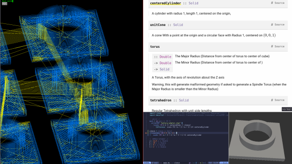

I have a [waterfall-cad](https://hackage.haskell.org/package/waterfall-cad) workflow now starting with a [template "aavogt/battery-adapter"](https://github.com/aavogt/battery-adapter/archive/refs/heads/main.zip). Saving the main.hs file results in previews and output files being updated right away if it's a small model.

## Installation

    curl --proto '=https' --tlsv1.2 -sSf https://get-ghcup.haskell.org | sh # or see https://www.haskell.org/ghcup/install/
    for f in ghc cabal hls; do ghcup install $f; done
    apt install make f3d entr prusa-slicer 'libocct-*' occt-misc
    cabal install ghcid
    git clone https://github.com/aavogt/battery-adapter.git
    cd battery-adapter
    make

Also my [aavogt/gcodeviewer](https://github.com/aavogt/gcodeviewer) and maybe my [aavogt/ghcdoc](https://github.com/aavogt/ghcdoc) local documentation which is not necessarily better in all ways.
