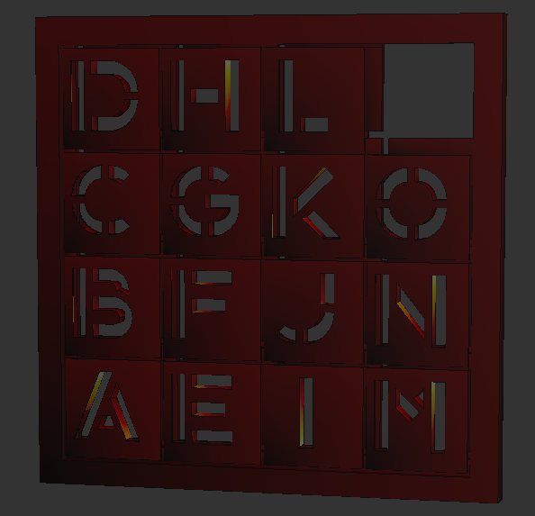
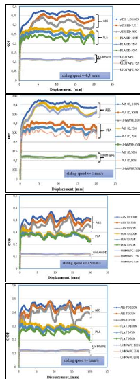
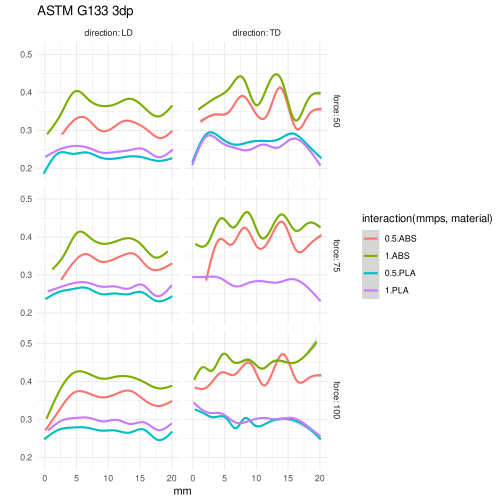

Often data is only available as a plot, and the goal is to replot or use it in a program. In the past I used engauge or webplotdigitizer for this task.
This time I was frustrated with webplotdigitizer and decided to do it with GIMP.

## [aavogt/digitizer](https://github.com/aavogt/digitizer)

I ended up using a [rust xcf parser](https://crates.io/crates/xcf). I prompted copilot (gpt-5.2-codex) with types, and my requested names for image coordinates, plot coordinates, image layer that defines the plot area, as well as what the output csv should look like. It's not a one-shot since rustc doesn't accept it right away but only small changes were needed to compile `main.rs`. One mistake was that I ended up with one csv file for each layer instead of a single csv for everything. More importantly, the initial results were wrong mostly in the y coordinate. In computer graphics the origin in at the top left, but plots usually have an origin on the bottom left. I didn't think of it right away. I chose to flip it at the end:

```c
xf = (x-xmin) / (xmax-xmin);
yf = (y-ymin) / (ymax-ymin);
xplot = (x1 - x0) * xf + x0;
yplot = y1 - (y1 - y0) * yf;
```

But that's not quite the end: x,y in `Layer::pixel(x,y)` doesn't use *canvas* coordinates, it uses *layer* coordinates. It turns out that `PROP_OFFSETS` has the `[dx,dy]` to recover canvas coordinates according to `x_canvas = x_layer + dx`.

The final code is [here](https://github.com/aavogt/digitizer/blob/main/src/main.rs), which could be improved mostly in aesthetics. For example `Option<()>` might become `bool` and `bounding_box()` was written before I know about `PROP_OFFSETS`, so it might be simplified to `ax.xmax = layer.pixels.width-1; ax.ymax = layer.pixels.height-1;`.

## Application

A print-in-place fifteen puzzle is my newest 3dp goal:



How does friction relate to extrusion line orientation, speed, pressure? I found [ASTM G133 pin-on-plate results in this paper](https://doi.org/10.37358/MP.21.1.5457).  I have trouble with the excel graphs because they have different scales. Here are their plots:




Using `GIMP` I take a couple minutes to select every colored region of the plot. Then `digitizer` outputs csvs that load with R/tidyverse/ggplot2. I replot ABS and PLA from their figure 7-10 below. With this arrangement, speed only matters for ABS in particular when moving in the longitudinal direction, the 100N-1mm/s-ABS run is different in a way that the averages over distances don't show.



digitizer outputs the all of the y coordinates for each x. Above I collapsed them into a single line with `geom_smooth` but the way I'm using it, the wiggliness depends on my arbitrarily chosen image resolution, and here it may be too low.


## Failed attempts

### Haskell

First I tried to revive [leino/xcf](https://github.com/leino/xcf). Only small changes are needed build it with ghc-9.6.7: see [here](https://github.com/aavogt/xcf). But unfortunately my xcf files are version v011 and can't be parsed as Version2 (v002). 

### Python

Next I tried with python. 

First I tried with gimpformats from pypi, but it doesn't load my image.

Instead I tried with Gimp's api. Here's how far I got:


```python
# in b.py
import gi
import numpy as np
import ctypes
gi.require_version('Gimp', '3.0')
from gi.repository import Gimp
from gi.repository import Gio
from gi.repository import Gegl
run_mode = Gimp.RunMode.NONINTERACTIVE

image = Gimp.file_load(run_mode, Gio.file_new_for_path("long_0.5.xcf"))

layers = image.get_layers()
layer_dict = {}
for layer in layers:
    name = layer.get_name()
    width = layer.get_width()
    height = layer.get_height()
    buffer = layer.get_buffer()
    data = buffer.get(Gegl.Rectangle.new(0, 0, width, height),
                        1.0, 
                      "R'G'B'A u8",
                      Gegl.AUTO_ROWSTRIDE)  
    pixels = np.frombuffer(data, dtype=np.uint8).reshape(width, height, 4)
    layer_dict[name] = pixels
# then find a rectangular layer with x0,x1,y0,y1
# then write the csv with header "name, xcanvas, ycanvas"
# for each pixel in the other layers that's not transparent
```


I didn't finish this. Gimp's api is not fun. For example `print(dir(layer.get_buffer()))` prints:

    ['__class__', '__copy__', '__deepcopy__', '__delattr__', '__dict__', '__dir__',
    '__doc__', '__eq__', '__firstlineno__', '__format__', '__gdoc__', '__ge__',
    '__getattribute__', '__getstate__', '__gpointer__', '__grefcount__',
    '__gsignals__', '__gt__', '__gtype__', '__hash__', '__info__', '__init__',
    '__init_subclass__', '__le__', '__lt__', '__module__', '__ne__', '__new__',
    '__reduce__', '__reduce_ex__', '__repr__', '__setattr__', '__sizeof__',
    '__static_attributes__', '__str__', '__subclasshook__', '_force_floating',
    '_ref', '_ref_sink', '_unref', '_unsupported_data_method',
    '_unsupported_method', 'add_handler', 'bind_property', 'bind_property_full',
    'chain', 'clear', 'command', 'compat_control', 'connect', 'connect_after',
    'connect_data', 'connect_object', 'connect_object_after', 'copy',
    'create_sub_buffer', 'damage_rect', 'damage_tile', 'disconnect',
    'disconnect_by_func', 'do_dispose', 'dup', 'emit', 'emit_stop_by_name',
    'find_property', 'flush', 'flush_ext', 'force_floating', 'freeze_changed',
    'freeze_notify', 'g_type_instance', 'get', 'get_abyss', 'get_data',
    'get_extent', 'get_properties', 'get_property', 'get_qdata', 'getv',
    'handler_block', 'handler_block_by_func', 'handler_disconnect',
    'handler_is_connected', 'handler_unblock', 'handler_unblock_by_func',
    'install_properties', 'install_property', 'interface_find_property',
    'interface_install_property', 'interface_list_properties', 'is_floating',
    'linear_close', 'list_properties', 'load', 'lock', 'new', 'new_for_backend',
    'newv', 'notify', 'notify_by_pspec', 'open', 'override_property', 'padding',
    'parent_instance', 'priv', 'props', 'qdata', 'ref', 'ref_count', 'ref_sink',
    'remove_handler', 'replace_data', 'replace_qdata', 'run_dispose',
    'sample_cleanup', 'save', 'set', 'set_abyss', 'set_color',
    'set_color_from_pixel', 'set_data', 'set_extent', 'set_pattern',
    'set_properties', 'set_property', 'set_source', 'share_storage',
    'signal_connect', 'source', 'steal_data', 'steal_qdata', 'stop_emission',
    'stop_emission_by_name', 'swap_create_file', 'swap_has_file',
    'swap_remove_file', 'thaw_changed', 'thaw_notify', 'unlock', 'unref',
    'watch_closure', 'weak_ref']

Which suggests we can have `layer.get_buffer().get_data()` but that's an error:

    File "/usr/lib/x86_64-linux-gnu/gimp/3.0/plug-ins/python-eval/python-eval.py", line 42, in code_eval
      exec(code, globals())
      ~~~~^^^^^^^^^^^^^^^^^
    File "<string>", line 1, in <module>
    File "<string>", line 19, in <module>
    File "/usr/lib/python3/dist-packages/gi/overrides/GObject.py", line 635, in _unsupported_data_method
      raise RuntimeError(
          "Data access methods are unsupported. Use normal Python attributes instead"
      )

So I try `.data`

    AttributeError: 'Buffer' object has no attribute 'data'. Did you mean: 'qdata'?

`.qdata` is some kind of glib array I didn't look into. But GIMP's API also has too much cleaning, where for example [a simple way to get the numpy array](https://stackoverflow.com/a/47554384) that exists in Gimp 2 is gone in Gimp 3. I end up finding the `.get` method which is a binding to [gegl_buffer_get](https://developer.gimp.org/api/gegl/method.Buffer.get.html), but the arguments are different, so I got it wrong at first: 

    batch command experienced a calling error:
    Traceback (most recent call last):
      File "/usr/lib/x86_64-linux-gnu/gimp/3.0/plug-ins/python-eval/python-eval.py", line 42, in code_eval
        exec(code, globals())
        ~~~~^^^^^^^^^^^^^^^^^
      File "<string>", line 1, in <module>
      File "<string>", line 20, in <module>
    TypeError: Must be string, not Object
    Stopping at failing batch command [0]: exec(open("b.py").read())

Which argument of `.get` is supposed to be a string and not an object? The error message doesn't say. It's the third one but I didn't figure that out until I came back to document it today.

While a gimp plugin might be easiest to use. It might be possible to click on the plugin name and then be guided step-by-step instead of following instructions my rust `digitizer` prints out:

    Prepare the XCF in GIMP:
    - Open the plot image.
    - Use Magic Wand or other tool to select each plot object, grow/shrink as needed,
      then press Ctrl-Shift-L, Ctrl-Shift-N, PageDown. Repeat until all objects are gone.
    - Select the plot area with the r (rectangle) tool, then press Ctrl-Shift-L, Ctrl-Shift-N
      and name the new layer "x0,x1,y0,y1" (e.g. "0,100,20,40") or just "x1,y1" if x0 and y0 are 0,
    - Rename each plot-object layer to the desired output CSV name column.
    - Leave the original image in the bottom layer: it will be skipped
