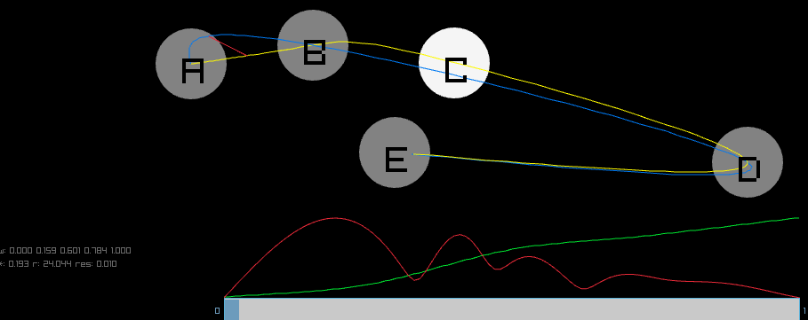

[Click here or the image to interact with the splines.](http://aavogt.github.io/splinesimp/main.html)

Click and drag the circles to and see how the original yellow abcde(s) spline differs from the simplified blue abde(t) spline.
The estimated warping path (green s(t)) is plotted above the roughness penalty slider at the bottom.
The red line segment connects abcde($s(t^*)$) to abde($t^*$), where $t^*$ maximizes the length, and s(t) minimizes that maximum plus the optional roughness penalty. The red graph is the shape of |abcde(s(t)) - abde(t)| vs t.
The roughness penalty slider value multiplies $\sum_i |s''(t_i)|dt$, and high values make s(t) a straight line.

# Background

I have a long-term interest in functional data --
dealing with samples of functions x(t) and y(t). Handwriting recognition is the
most recent application. One sub-problem is to decimate or simplify sampled
points, which reduces space and time required downstream at the cost of
introducing a bounded error.

Most commonly the [Ramer-Douglas-Peuker algorithm](https://en.wikipedia.org/wiki/Ramer%E2%80%93Douglas%E2%80%93Peucker_algorithm) is used. 
It interprets the input points as being connected by straight line segments.
So the error introduced by deleting point $j$ or replacing ijk(t) with ik(t) is
a point-line segment distance, which we might compute with:

    // Squared perpendicular distance between the line from index i to k,
    // and the point at index j
    //
    // Here i,j,k refer to vectors [xs[i], ys[i]].
    // any point p along the i-k line is: p = i + (k-i)t
    // If p makes the perpendicular dropping from j to segment k-i:
    // 0 = (j-p) . (k-i)
    // substitute p and expand:
    // 0 = (j-i).(k-i) - t |k-i|^2
    // 0 =     num     - t *  den
    // finally evaluate p-j:
    // = i + (k-i)t - j 
    // =    (k-i)*t - (j-i)
    double pdist_at(int i, int j, int k) {
      double xki = xs[k] - xs[i], xji = xs[j] - xs[i];
      double yki = ys[k] - ys[i], yji = ys[j] - ys[i];
      double num = xki * xji + yki * yji; // (j-i) . (k-i)
      double den = xki * xki + yki * yki; // |k-i|^2
      if (den < 1e-8) {
        // the i-k segment is too short: just return the distance i-j
        return xji * xji + yji * yji;
      }
      double t = Clamp(num / den, 0, 1);
      double dx = xki * t - xji;
      double dy = yki * t - yji;
      return dx * dx + dy * dy;
    }

I spent about a week trying to find the equivalent function for cubic splines.
At first I used maxima and made a mess starting with the Catmull-Rom spline
definition from
[rshapes.h](https://github.com/raysan5/raylib/blob/d4f636151b2d1e27249d4fe7859f11d6b7bc4d73/src/rshapes.c#L2201),
and try to find [stationary
points](https://en.wikipedia.org/wiki/Stationary_point) of the distance between splines.
The distance is then abcd(s)-abde(t) or abcd(t)-bcde(u) for some particular
s,t,u. Without loss of generality, focus on abcd(s)-abde(t). The cubic spline
has terms up to $s^3$ or $t^3$, so the squared distance between them is function of $s^6$ and $t^6$.
the stationary points then give two polynomial equations in both s and t with
terms up to $s^5$ or $t^5$. The [resultant](https://en.wikipedia.org/wiki/Resultant) gives one way to solve such equations,
but with maxima the resultant function doesn't terminate in a reasonable time. So I take a step back and work with the 
[Sylvester or Bezout](https://maxima.sourceforge.io/docs/manual/Polynomials.html#bezout) matrix whose determinant is the resultant. A determinant must be hard to calculate with symbolic entries. I have not looked into details of maxima's "subresultant polynomial remainder sequence", but the number of terms would be very high using a Laplace expansion rule and doing a LU decomposition involves row operations such as in the 2x2:

    a b
    c d

eliminate c:

    a b
    0 (d - c*b/a)

and then the determinant is the product of the diagonal entries $a (d - c b/a)$ which expands out to the usual. It's possible to do calculations with [rational functions](https://github.com/aavogt/controltheory/blob/3f693f9ef0f1c8ce95d19079737b405acba74b6d/R/controltheory.R#L37), and maybe that approach could work here. Instead I decided to switch out of symbolic land into numerical land. The 
 Bezout matrix is a 5x5 matrix of univariate polynomials in t up to t^8, using 122 coefficients in total. Then I use LAPAKE_dgetrf to compute the LU decomposition for particular coefficients and values of t, and numerically search for the t in [0,1] which makes it equal zero. Then each candidate t can be substituted back into one of the original multivariate polynomials that defines the stationary point. I solve that univariate polynomial degree 5 ($s^5$) using LAPACKE_dhseqr on the [Frobenius companion matrix](https://en.wikipedia.org/wiki/Companion_matrix). But unfortunately it's not right: s=0 t=1 or similar points are always the farthest apart and other stationary points don't quite look right either. For a long time I thought I had a mistake somewhere. Now I believe the missing piece was the warping function which expresses the idea that both splines are related paths being traversed in the same direction without reversing, but the speeds used don't have to match at all.
It might be possible from maxima, but my attempt at [I-splines](https://en.wikipedia.org/wiki/I-spline) didn't show the correct properties after a quick attempt.

Instead I decided to use GSL for the numerical version, which is the demo at top. It estimates the warping function parameters (pw) with gsl_multimin_fminimizer which in turn uses gsl_min_fminimizer to find $t^*$ which maximizes the distance between the splines. Details are in [main.c](http://aavogt.github.io/splinesimp/main.c). I would have preferred to use nlopt's subplex which has better aesthetics and possibly performance, but I gave up on building it with [emscripten](https://emscripten.org/).
