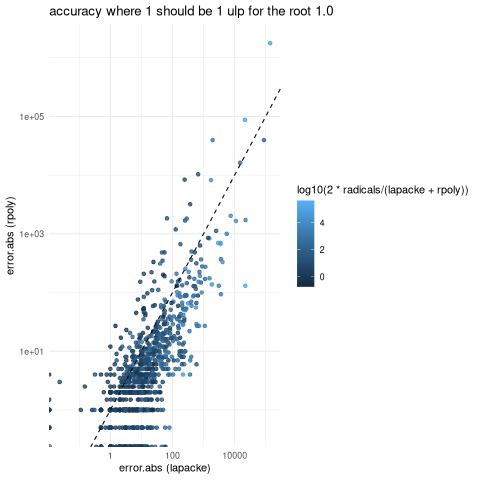
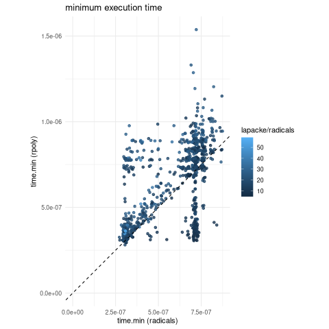
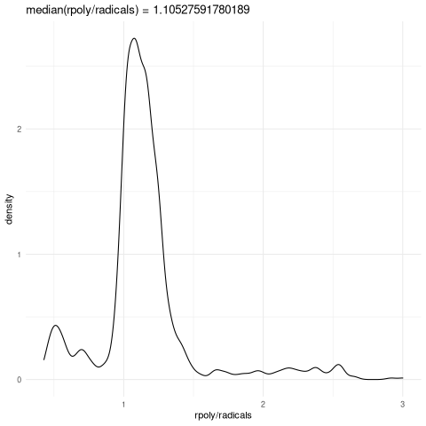

I was not sure about which method to use for solving cubic equation, as I am using cubic smoothing splines in the handwriting project `wip/gregg-board-rs` and I would like to iterate over roots when inferring features like baselines. I tried three methods, is a [cubic equation](https://en.wikipedia.org/wiki/Cubic_equation) actually just the version maxima produces with

    load("codegen.mac");
    sum(a[i] * x^(3-i), i, 0, 3)$
    solve(%, x);
    fullratsimp(%);
    roots : map(rhs, %), numer;
    with_stdout("cubic_gen.rs", codegen(roots));

With some adjustment needed as my codegen.mac doesn't quite track the necessary c64() coercions.
It's almost bad enough to go back to generating c and then figure out bindgen/ffi. Below we'll refer to it as `radicals`

The second option is to make the Frobenius companion matrix and find it's eigenvalues which are exactly the roots of the polynomial. In this case we use `lapacke` zgeev. The last and best option is [rpoly](https://crates.io/crates/rpoly), but it's still interesting to find out exactly how much better in terms of speed and accuracy.

The input polynomials are specified in terms of their roots. Two roots are point on a unit square according [lhs::geneticLHS](https://cran.r-project.org/web/packages/lhs/index.html), and the other root is 1. Then I get the time needed to solve it 100 times and calculate error. Here are the results:

It's slightly suspect that occasionally error.abs is less than one ulp? I used `double ulp = 1. - nextafter(1, 2) = 2.22e-16`. I add up the error from the 100 replicates so if most of the replicates have 0 error it seems plausible. Please continue to question, but the rest of the story makes sense: `rpoly` is usually more accurate as most the points are below the dotted line error.abs(rpoly) = error.abs(lapacke). The cubic equation `radicals` is much less accurate than either (10 to 10000 times) so it's plotted as color where light blue is $10^4$ and dark blue is $10^0$ times slower than the average.

In the next plot we have execution time in seconds. Here `lapake` is 10-40 times slower than `radicals`, and `rpoly` is usually slower than `radicals`

How much? It's hard to tell exactly so here's another plot, where we take the y/x values in the above plot and show how frequently different values occur. On average `rpoly` takes 10-15% longer, but occasionally can take 3 times as long.

It would be nice to continue this topic with a search for parameters to get equal time or equal accuracy. For example `Complex<f128>` for some subexpressions in `radicals` might fix the accuracy and there could be a way to .
A [EPM](https://gist.github.com/aavogt/595195c7eaf17972c5a85c55fd7bd350) might help to find the map or formula to decide between methods.
