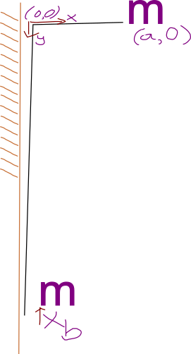
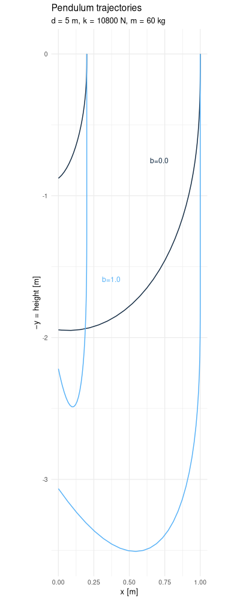
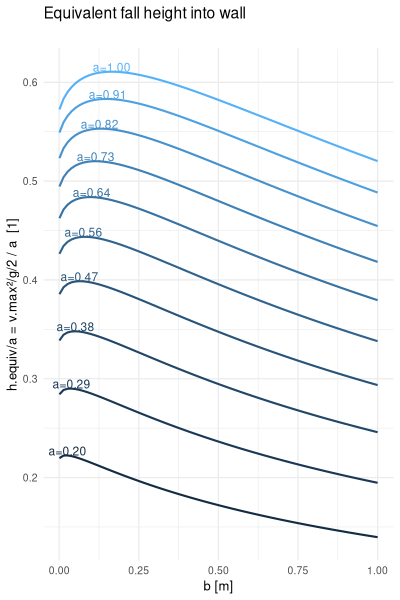
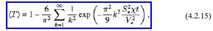
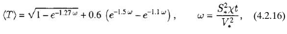
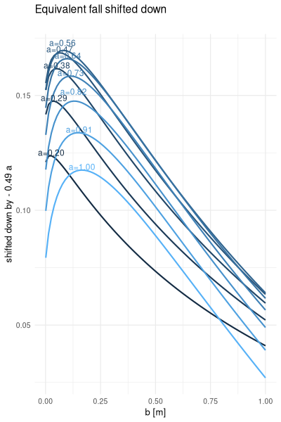
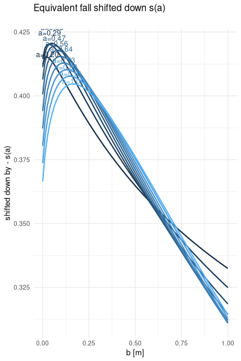
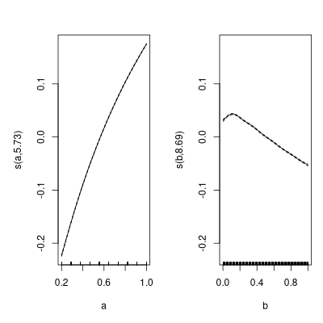
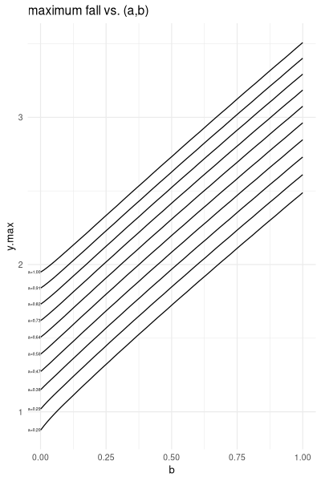

I've been lead climbing again. How much does extra slack affect the speed with which you hit the wall? Here's a model:

## Model

The climber starts falling at the height of the last draw, a distance $a$ out from the wall. Let $b$ be the extra slack and $d$ be the length of rope from the belayer to the first draw. The climber's acceleration due to the rope points towards (0,0), and is proportional to the rope stretch. The spring constant $k / (a+b+d)$ is probably off. 
[Here is the R script](https://gist.github.com/aavogt/f89f750f9ee3136ae642f2a764c82e55). For ODEs there are other languages like OpenModelica or ModelingToolkit.jl which are supposed to hide details. For example I split $m y'' = F$ into two equations $m v' = F; y' = v$, but these modeling languages may let you call der(x) instead of vx which avoids a possible mistake where vx isn't what it claims to be. Also many equations that relate separate components can be added with a single connect(). Maybe I'll try Modia.jl next time, which may have been unsuitable last time (membrane dehumidifier) for a lack of flow variables.

## Solved trajectory
Here is a plot of 4 trajectories:

You can start out close to the wall $a=0.2$ or far from the wall $a=1$, and from either starting point there's either the light blue extra slack or dark blue minimum slack case. In the next section I evaluated a range of $a$ and $b$ values.

## Maximum x velocity

For the next section we're looking at the horizontal speed with which the climber hits the wall.
I convert the maximum x velocity (as x=0) into an equivalent height because 9.8 m/s isn't as informative as a 1 m fall. 
I also divide by the initial distance to the wall to the vertical axis, making the vertical axis dimensionless. It also bring the curves closer together.

Begin digression:
Ideally we find a simple transformation that overlays the separate curves. Then the dependency on $a$ no longer takes up space in the plots, and a different (dimensionless) parameters can be explored such as $a/d$ $m/mb$ $k / g m$...  A SymbolicRegression.jl or https://herbie.uwplse.org/ type of search would likely find an informative expression . This reminds me how heat transfer derivations will often say it's solved when you have a series instead of something more manageable:

  <1.5% error

End digression. Interestingly there's a $b$ value maximizes this velocity, which is a realistic amount of slack:

To compare shapes, remove the variation caused by $a$, first from a gam(x.equiv.fall ~ a + s(b)) and then from a gam(x.equiv.fall ~ a + s(b)):

The two smooths are:

Less interesting is the total fall:

There are still questions:

  * what side of the maximum equivalent height are we on
  * how much to increase b to reach the other side
  * having more time to prepare for impact likely has a bigger effect than speed variation
  * gravity affects the leg force when landing a 0.5 m fall, but it has no effect on the wall landing, so correcting it 
  * render a simulation similar to [splines](http://localhost:8001/posts/2026-02-04-spline.html) getting into gamedev

