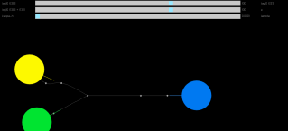
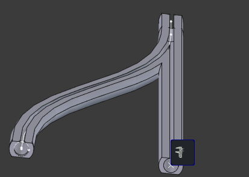

March 14 edit: add screenshot; explain parameters; add AMS video; note AMS/ERCF designs

# instructions

Open the web app by clicking on the image link. Drag the circles and ticks to adjust the initial tangent. Watch the wye defined by the interpolation of the small gray circles slide into place, but sometimes it gets lost so reload the page or press the space bar to reset. Sliders modify parameters:

- EI[0]: stiffness of the (starting at) yellow filament

- EI[1]: stiffness of the (starting at) blue filament

- EI[0] + EI[1]: decrease or increase both stiffnesses while maintaining their ratio

- w: high values prioritize yellow tension, low values prioritize blue tension

- lambda: penalty for sharp bends at the junction

[source](http://aavogt.github.io/filament/main.c)

# background

Using the same tools as [spline decimation 2026-02-04](https://aavogt.github.io/blog/posts/2026-02-04-spline.html), I try to solve a different problem: is the 
usual symmetrical 3d printer filament wye fitting such as [the smoothy](https://makerworld.com/en/models/18174-the-smoothy-y-splitter-connector#profileId-17021k) optimal? This fitting is used in a system like Bambu AMS to allow a single nozzle 3d printer to automatically switch between filaments for different colors or material properties in the same print. ERCF_v2 avoids this fitting by moving the outlet PTFE tube, but my design will be more like AMS.

It's possible that asymmetry is better, since the filaments have different properties, and the filament more likely to snap or clog can go on the straight path:

## theory

The [capstan equation](https://en.wikipedia.org/wiki/Capstan_equation) is for ropes that don't resist bending. Many paths are optimal for that model. The examples on the wikipedia page give an intuition we don't need to develop farther: looking at the smoothy fitting, the inputs are parallel and 1cm apart, which adds extra turns and friction when the filament reels are side-by-side in a dry box. An unnecessary second s-curve is needed to reduce the inlets from ~10cm apart to 1cm apart, which needs extra PTFE tubing to do it over a long distance like 30cm to keep the extra turning angle small. But filament stiffness might matter, since the force applied to achieve a specified bend might oppose the normal force due to filament tension, and so end up invalidating the capstan equation intuition.

Instead of finishing Bigoni's Solid Mechanics book, for now I assume we can just add a term to the capstan equation to account for filament stiffness as follows:

$dT/dt =  \mu v ( T \kappa + EI \kappa'' )$

$T(0) = 0$

$v = hypot(dxdt, dydt)$

here $\kappa$ is the [curvature](https://en.wikipedia.org/wiki/Curvature#Signed_curvature), and we have some complications because the x(t) y(t) splines are parameterized by an arbitrary parameter not arc length and $\kappa''$ should be a derivative with respect to arc length, so there may be the wrong number of speed $v$ terms involved.

## limitations

`gsl_multimin_fminimizer_nmsimplex2` picks the points that define the filament path. As I noted above it's not great, and cobyla or simulated annealing would be better, and the lambda penalty could be a proper constraint (turn change the penalty according to augmented Lagrangian method if I stay with gsl_multimin).
