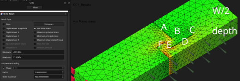
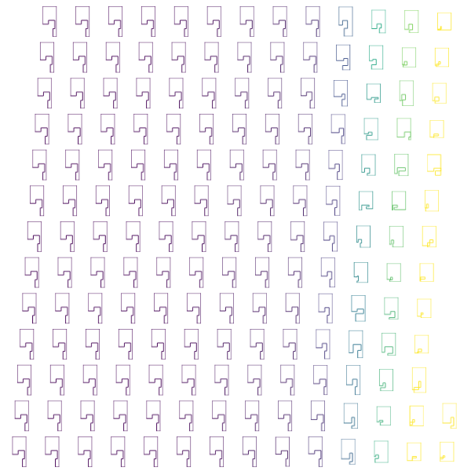

Edit: 2026-03-31 reword and add Previously section

[NeedItMakeIt Adapting the BEST Woodworking Joints for 3D Printing](https://www.youtube.com/watch?v=WY8yd191qVE) designs and tests a whole joint, but is the profile optimal? [aavogt/contact_fem](https://github.com/aavogt/contact_fem) is a simulation of such a profile using only right angles. It sets up and solves a plane strain nonlinear geometry contact problem without friction. In the picture below, the left block (groove) is fixed and right block (tongue) is pulled away. The faces on the bottom right can only move in the same axis as the pull (y). My intention is that the actual part will be mirrored across this face. Such an assumption would be wrong for compression, where the beam will buckle and take on an S-shape. In tension it probably won't happen.

I maximize the applied/reaction force when the most stressed element reaches 21 MPa by a linear interpolation of 4 fixed displacements. This is my guess for point at which something will break. Below are all the candidate tongue profiles selected either by [lhs::geneticLHS](https://search.r-project.org/CRAN/refmans/lhs/html/geneticLHS.html) or [nloptr::cobyla](https://search.r-project.org/CRAN/refmans/nloptr/html/cobyla.html). The optimal tongue width (W/2 - A - C) looks too small, but it's not red in the above image, so it's a problem with the model in general.

[Golconda-esque](https://en.wikipedia.org/wiki/Golconda_(Magritte)#)

## Previously

Previously I did a [parametric optimization for a dome/shell](https://gist.github.com/aavogt/84f74f4dd00d341f62a7faeeae8a7be4) around the freecad 0.22 release. There the .FCstd file defines parameters, geometry and FEM/calculix setup, and the .py file modifies and evaluates it. This time I use `freecad --console` to build and run the .FCStd file the freecad gui only helps me to decide which functions to call and to look at some of the results.

## TODO

- [ ] optimize for stiffness too
- [ ] shear or rotation instead of tension: this should help to decide equally strong geometric profiles
- [ ] round corners or bevels in the sketch to reduce stress concentrations
- [ ] compare `solver.ModelSpace = "plane strain"` to the default 3d without the zero x,z displacement boundary
- [ ] TPU material https://gist.github.com/aavogt/eaee6977df84984a8b7827b8121b8c55
- [ ] path along which the profile is swept https://claude.ai/public/artifacts/6eb71c6d-d590-4ad5-9887-6031f6adefad
