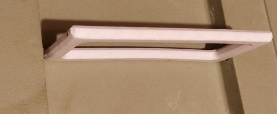
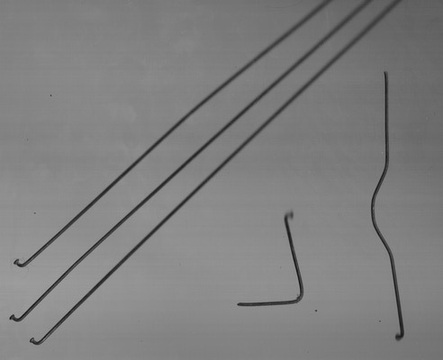
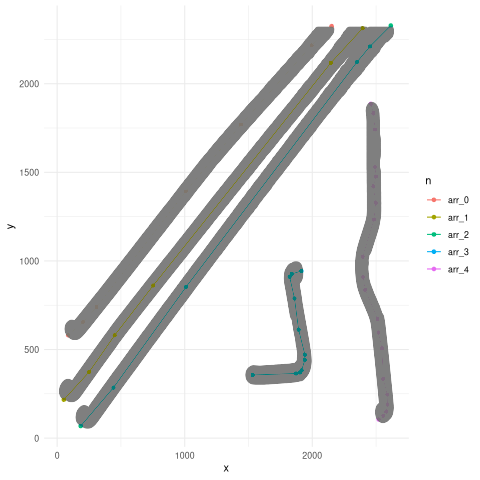
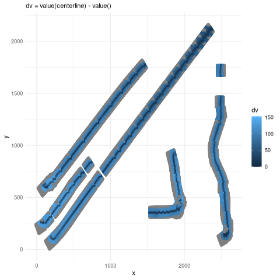
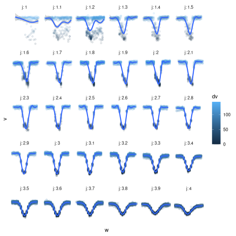
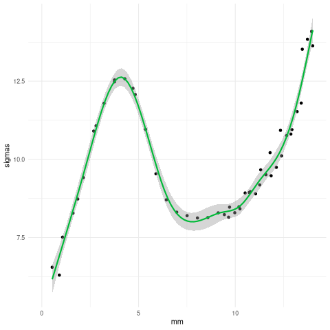
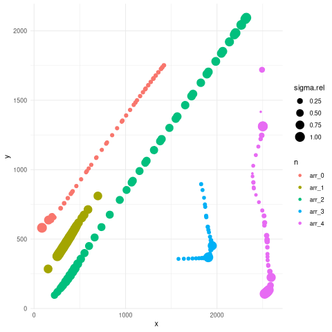

Two weeks ago I 3d printed a replacement cat carrier handle. I added straight holes in the model and inserted the cut wires into the handle using a drill and hammer. In this case I cut old bicycle spokes by notching it with a file and bending with pliers. This way the handle is comfortable, strong and relatively easy to assemble.

Bent wires are a popular material. In the 3d printing culture, PLA-wire composites are rare. Maybe they're missing software. Instead of inserting wires/pins as above, printing around pre-bent wires seems promising. But that order-of-operations introduces two problems: the cavity in the 3d model has to match the wire within ~0.1 mm, and the generated g-code needs a pause and collision avoidance[^section]. Bending a c-shaped wire using hand tools or even with a wire bending CNC may not be that accurate because the wire springs back a bit. Instead of making the wire fit the drawing, it seems easier to make drawing fit the wire.

In the rest of this post I'm dealing with the first problem: getting a 3d model of a bent wire. With digital calipers and protractor it seems possible to match the straight segments but I don't think curves would match well enough. But I have a flatbed scanner, and I use the following scan of straight and bent wires to explore the option:

The three straight spokes on the left are 14 mm above the glass at the top.
It looks like the wire z coordinates could be found because wires touching the glass are sharp
and wire farther away is blurry, and the amount of blur changes with distance. This
exact problem seems to be missing from the [depth from defocus literature](https://arxiv.org/abs/2603.26658),
where they use other subjects with multiple pictures (focus stack).
Here it seems like a single image will do at first. Eventually I would like to combine scans of different
orientations.

The first step is segmentation. This means assigning labels `n` to each pixel
so that each wire can be treated separately.
Initially I tried using my [2026-01-21-digitizer.html](https://aavogt.github.io/blog/posts/2026-01-21-digitizer.html) but the xcf crate I used there does not support monochrome images I happened to have. I could have converted the scan but I wanted to try another way.
So I adapted [alkasm/magicwand](https://github.com/alkasm/magicwand/tree/master) to output masks.

Then the next script loads the image and masks and dilates the mask to produces
the gray outline below. The colored lines look like good center-lines. I calculate them from 
princurve::principal_curve and RDP::RamerDouglasPeucker applied to the skeleton of the gray points (scikit medial
axis transform).

Next I use akima::interpp to resample the scan `(x,y,v)` tuples into `j` samples in the centerline Frenet frame `(u,w,v)` with `u` measuring parallel to the tangent and `w` measuring a 90° rotation. The pixel values relative to the center are then:

The next two plots only include `n == arr_2` because the straightest wire makes z height (`mm`) easy to calculate from distance along the curve (`j`).

j=1 is the end touching the glass, and j=4 is 14 mm above the glass.
A Gaussian with different parameters fits each panel above giving sigma(j) or sigma(mm).
The plot of sigma(mm) below is promising.
But sigma alone isn't enough for the calibration because it's flat in two areas and the inverse is multi-valued. So given sigma=10 could mean the wire is 2 mm, 6 mm or 12.4 mm above the glass. The other parameter in the Gaussian should help, but it's likely that other options may be needed. There should be better options than Gaussian here.

Plotting the same sigma.rel = sigma / max(sigma) for each wire in scan coordinates:

This graph shows another problem: curvature of the centerline increases sigma more than defocus blur. I haven't decided how to continue here. I could continue the data-driven approach. I would then scan z=constant wires with different curvatures, and fit sigma(curvature). Or there's a more theoretical approach where Gaussian / erf / tophat functions that fits the `arr_2` data defines a point spread function (PSF) which then can produce the image expected from a point cloud (wire surface). A PSF may not be enough by itself either, since light reflecting off a wire lights up nearby wires so it may be necessary to approximate the brightness of proposed wire surfaces, then blur/project them with the PSF and then correct the proposed wires to better fit the scan.

[^section]: [section :: Solid -> Plane -> [Path]](https://github.com/aavogt/rapids/blob/2fbe56b1807203c30af7381ca1d7ec88d328ff6a/lib/Rapids/Section.hs#L77) with `loft :: [Path] -> Solid` or `hull :: [Path] -> Solid` applied to part of [Hoon's model](https://www.printables.com/model/474314-ender-5-s1-full-cad-model-wip/collections) should approximate the [solid B-rep sweep](https://arxiv.org/abs/1305.7351) that opencascade doesn't have.
